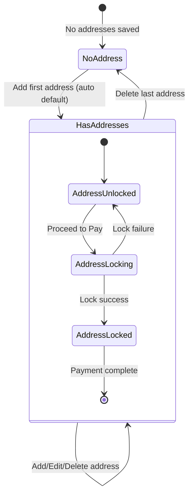

# Design Document: Address Management & Checkout Address Flow

## Overview

This document outlines the design for a manual address management system and checkout address flow for the ShamBit Android application. The system provides a reliable, lightweight solution for managing delivery addresses without GPS, maps, or external APIs. The design focuses on preventing common issues such as payment page failures, screen flicker, cart resets, and ensuring every order has a valid address.

### Key Design Principles

1. **Simplicity First**: Manual address entry only, no location services
2. **Reliability**: Robust error handling and state management
3. **Data Integrity**: Single source of truth for default address
4. **User Experience**: Smooth transitions without page reloads or cart resets
5. **Safety**: Address locking before payment to prevent order errors

## Architecture

The system follows the existing Android app architecture using:

- **MVVM Pattern**: Model-View-ViewModel for presentation layer
- **Repository Pattern**: Data layer abstraction
- **Dependency Injection**: Hilt for dependency management
- **Jetpack Compose**: Modern declarative UI framework
- **Coroutines & Flow**: Asynchronous operations and reactive state management

### Architecture Layers

```
┌─────────────────────────────────────────────────────────┐
│                  Presentation Layer                      │
│  ┌──────────────┐  ┌──────────────┐  ┌──────────────┐  │
│  │   Screens    │  │  ViewModels  │  │  UI States   │  │
│  │  (Compose)   │  │   (Logic)    │  │   (Data)     │  │
│  └──────────────┘  └──────────────┘  └──────────────┘  │
└─────────────────────────────────────────────────────────┘
                          │
                          ▼
┌─────────────────────────────────────────────────────────┐
│                    Domain Layer                          │
│  ┌──────────────┐  ┌──────────────┐  ┌──────────────┐  │
│  │  Use Cases   │  │   Models     │  │  Validators  │  │
│  └──────────────┘  └──────────────┘  └──────────────┘  │
└─────────────────────────────────────────────────────────┘
                          │
                          ▼
┌─────────────────────────────────────────────────────────┐
│                     Data Layer                           │
│  ┌──────────────┐  ┌──────────────┐  ┌──────────────┐  │
│  │ Repositories │  │  API Service │  │  Local Cache │  │
│  └──────────────┘  └──────────────┘  └──────────────┘  │
└─────────────────────────────────────────────────────────┘
```

## Components and Interfaces

### 1. Data Layer Components

#### AddressRepository
```kotlin
interface AddressRepository {
    suspend fun getAddresses(): NetworkResult<List<Address>>
    suspend fun addAddress(request: AddAddressRequest): NetworkResult<Address>
    suspend fun updateAddress(id: String, request: UpdateAddressRequest): NetworkResult<Address>
    suspend fun deleteAddress(id: String): NetworkResult<Unit>
    suspend fun setDefaultAddress(id: String): NetworkResult<Address>
}
```

#### AddressCache
```kotlin
interface AddressCache {
    suspend fun cacheAddresses(addresses: List<Address>)
    suspend fun getCachedAddresses(): List<Address>?
    suspend fun getDefaultAddress(): Address?
    suspend fun updateCachedAddress(address: Address)
    suspend fun removeCachedAddress(id: String)
    suspend fun clear()
}
```

### 2. Domain Layer Components

#### Address Model
```kotlin
data class Address(
    val id: String,
    val name: String,
    val phoneNumber: String,
    val houseStreetArea: String,
    val city: String,
    val pincode: String,
    val type: AddressType,
    val isDefault: Boolean,
    val createdAt: String
)

enum class AddressType {
    HOME, WORK, OTHER
}
```

#### AddressValidator
```kotlin
interface AddressValidator {
    fun validateName(name: String): ValidationResult
    fun validatePhoneNumber(phone: String): ValidationResult
    fun validateHouseStreetArea(address: String): ValidationResult
    fun validateCity(city: String): ValidationResult
    fun validatePincode(pincode: String): ValidationResult
    fun validateAddress(address: AddAddressRequest): ValidationResult
}

sealed class ValidationResult {
    object Valid : ValidationResult()
    data class Invalid(val errors: Map<String, String>) : ValidationResult()
}
```

#### Use Cases
```kotlin
// Core address operations
class GetAddressesUseCase
class AddAddressUseCase
class UpdateAddressUseCase
class DeleteAddressUseCase
class SetDefaultAddressUseCase

// Checkout-specific operations
class GetCheckoutAddressUseCase
class SelectCheckoutAddressUseCase
class LockCheckoutAddressUseCase
```

### 3. Presentation Layer Components

#### AddressViewModel
Manages address list state and operations for Manage Address screen.

```kotlin
class AddressViewModel : ViewModel() {
    val addressesState: StateFlow<AddressListState>
    val operationState: StateFlow<OperationState>
    
    fun loadAddresses()
    fun setDefaultAddress(id: String)
    fun deleteAddress(id: String)
    fun refreshAddresses()
}

sealed class AddressListState {
    object Loading : AddressListState()
    data class Success(val addresses: List<Address>) : AddressListState()
    data class Error(val message: String) : AddressListState()
    object Empty : AddressListState()
}

sealed class OperationState {
    object Idle : OperationState()
    object Loading : OperationState()
    data class Success(val message: String) : OperationState()
    data class Error(val message: String) : OperationState()
}
```

#### AddAddressViewModel
Manages add/edit address form state and validation.

```kotlin
class AddAddressViewModel : ViewModel() {
    val formState: StateFlow<AddressFormState>
    val validationErrors: StateFlow<Map<String, String>>
    val saveState: StateFlow<SaveState>
    
    fun updateName(name: String)
    fun updatePhoneNumber(phone: String)
    fun updateHouseStreetArea(address: String)
    fun updateCity(city: String)
    fun updatePincode(pincode: String)
    fun updateType(type: AddressType)
    fun updateIsDefault(isDefault: Boolean)
    fun saveAddress()
    fun loadAddress(id: String)
}

data class AddressFormState(
    val id: String? = null,
    val name: String = "",
    val phoneNumber: String = "",
    val houseStreetArea: String = "",
    val city: String = "",
    val pincode: String = "",
    val type: AddressType = AddressType.HOME,
    val isDefault: Boolean = false,
    val isEditMode: Boolean = false
)
```

#### CheckoutViewModel
Manages checkout flow including address selection and locking.

```kotlin
class CheckoutViewModel : ViewModel() {
    val checkoutState: StateFlow<CheckoutState>
    val selectedAddress: StateFlow<Address?>
    val cartItems: StateFlow<List<CartItem>>
    val addressLockState: StateFlow<AddressLockState>
    
    fun loadCheckoutData()
    fun selectAddress(address: Address)
    fun proceedToPayment()
    fun lockAddress()
}

data class CheckoutState(
    val hasAddress: Boolean,
    val isAddressLocked: Boolean,
    val canProceedToPayment: Boolean,
    val totalAmount: Double
)

sealed class AddressLockState {
    object Unlocked : AddressLockState()
    object Locking : AddressLockState()
    data class Locked(val address: Address) : AddressLockState()
    data class LockFailed(val error: String) : AddressLockState()
}
```

#### HomeViewModel
Manages home screen state including default address display.

```kotlin
class HomeViewModel : ViewModel() {
    val defaultAddress: StateFlow<Address?>
    val showAddressBottomSheet: MutableStateFlow<Boolean>
    
    fun loadDefaultAddress()
    fun openAddressSelection()
    fun selectAddress(address: Address)
}
```

### 4. UI Components

#### AddressSelectionBottomSheet
Modal bottom sheet for address selection.

```kotlin
@Composable
fun AddressSelectionBottomSheet(
    addresses: List<Address>,
    selectedAddressId: String?,
    onAddressSelected: (Address) -> Unit,
    onAddNewAddress: () -> Unit,
    onManageAddresses: () -> Unit,
    onDismiss: () -> Unit
)
```

#### AddressCard
Reusable address display component.

```kotlin
@Composable
fun AddressCard(
    address: Address,
    isSelected: Boolean = false,
    showActions: Boolean = false,
    onEdit: (() -> Unit)? = null,
    onDelete: (() -> Unit)? = null,
    onSetDefault: (() -> Unit)? = null,
    onClick: (() -> Unit)? = null
)
```

#### AddressForm
Form component for add/edit address.

```kotlin
@Composable
fun AddressForm(
    formState: AddressFormState,
    validationErrors: Map<String, String>,
    onNameChange: (String) -> Unit,
    onPhoneChange: (String) -> Unit,
    onHouseStreetAreaChange: (String) -> Unit,
    onCityChange: (String) -> Unit,
    onPincodeChange: (String) -> Unit,
    onTypeChange: (AddressType) -> Unit,
    onIsDefaultChange: (Boolean) -> Unit
)
```

## Data Models

### API DTOs (Existing)

The system will use existing API DTOs with minor modifications:

```kotlin
// Request DTOs
data class AddAddressRequest(
    val name: String,
    val phoneNumber: String,
    val addressLine1: String,  // Maps to houseStreetArea
    val city: String,
    val pincode: String,
    val type: String,
    val isDefault: Boolean
)

data class UpdateAddressRequest(
    val name: String?,
    val phoneNumber: String?,
    val addressLine1: String?,
    val city: String?,
    val pincode: String?,
    val type: String?,
    val isDefault: Boolean?
)

// Response DTO
data class AddressDto(
    val id: String,
    val userId: String,
    val name: String,
    val phoneNumber: String,
    val addressLine1: String,
    val city: String,
    val pincode: String,
    val type: String,
    val isDefault: Boolean,
    val createdAt: String,
    val updatedAt: String
)
```

### Domain Models

```kotlin
data class Address(
    val id: String,
    val name: String,
    val phoneNumber: String,
    val houseStreetArea: String,
    val city: String,
    val pincode: String,
    val type: AddressType,
    val isDefault: Boolean,
    val createdAt: String
) {
    fun toDisplayString(): String {
        return "$houseStreetArea, $city - $pincode"
    }
    
    fun toShortDisplayString(): String {
        return "${type.displayName} - $city"
    }
}

enum class AddressType(val displayName: String, val apiValue: String) {
    HOME("Home", "home"),
    WORK("Work", "work"),
    OTHER("Other", "other");
    
    companion object {
        fun fromApiValue(value: String): AddressType {
            return values().find { it.apiValue == value } ?: OTHER
        }
    }
}
```

### State Models

```kotlin
// Checkout address state
data class CheckoutAddressState(
    val selectedAddress: Address?,
    val isLocked: Boolean,
    val lockTimestamp: Long?
)

// Address operation result
sealed class AddressOperationResult {
    data class Success(val address: Address?, val message: String) : AddressOperationResult()
    data class Error(val message: String, val code: String?) : AddressOperationResult()
}

// Delete confirmation state
data class DeleteConfirmationState(
    val addressToDelete: Address?,
    val isLastAddress: Boolean,
    val isDefaultAddress: Boolean,
    val isCurrentlySelected: Boolean
)
```

## Correctness Properties

*A property is a characteristic or behavior that should hold true across all valid executions of a system-essentially, a formal statement about what the system should do. Properties serve as the bridge between human-readable specifications and machine-verifiable correctness guarantees.*


### Property 1: Single Default Address Invariant
*For any* address list with one or more addresses, exactly one address must have Default status at all times
**Validates: Requirements 1.3, 2.2, 4.1, 4.2, 4.5**

### Property 2: Address Creation Success
*For any* valid address data (all required fields present, phone is 10 digits, pincode is 6 digits), creating an address should succeed and return the saved address
**Validates: Requirements 1.1**

### Property 3: Phone Number Validation
*For any* phone number string, validation should pass if and only if it contains exactly 10 digits
**Validates: Requirements 1.6**

### Property 4: Pincode Validation
*For any* pincode string, validation should pass if and only if it contains exactly 6 digits
**Validates: Requirements 1.7**

### Property 5: Required Field Validation
*For any* address submission with one or more missing required fields, the system should prevent submission and return field-level validation errors for each missing field
**Validates: Requirements 1.5**

### Property 6: Save Operation Feedback
*For any* successful address save operation (create or update), the system should display a success confirmation message
**Validates: Requirements 1.4, 2.4**

### Property 7: Address Update Preservation
*For any* existing address, updating its fields should preserve the address ID and only modify the specified fields
**Validates: Requirements 2.1**

### Property 8: Default Status Preservation During Edit
*For any* default address, editing its non-default fields should preserve its default status
**Validates: Requirements 2.3**

### Property 9: Checkout Address Synchronization
*For any* address that is currently selected in checkout, editing that address should immediately reflect the updated information in the checkout display
**Validates: Requirements 2.5**

### Property 10: Delete Confirmation Display
*For any* address deletion attempt, the system should display a confirmation dialog before proceeding with deletion
**Validates: Requirements 3.1**

### Property 11: Non-Default Address Deletion
*For any* non-default address in a list with multiple addresses, deleting it should remove only that address and preserve the current default address
**Validates: Requirements 3.2**

### Property 12: Default Address Deletion with Alternatives
*For any* default address in a list with multiple addresses, deleting it should automatically select the most recently added remaining address as the new default
**Validates: Requirements 3.3, 11.5**

### Property 13: Delete Operation Error Recovery
*For any* failed delete operation, the system should restore the address in the UI and display an error message
**Validates: Requirements 3.5**

### Property 14: Home Screen Default Display
*For any* system state with at least one address, the home screen should display the default address
**Validates: Requirements 4.3**

### Property 15: Default Address Change Propagation
*For any* default address change, the system should immediately update the home screen and checkout flow without page reload
**Validates: Requirements 4.4**

### Property 16: Address Selection Bottom Sheet Display
*For any* address list, the address selection bottom sheet should display all addresses with a tick mark on the currently selected address
**Validates: Requirements 5.2**

### Property 17: Address Selection Application
*For any* address selected from the bottom sheet, the system should apply the selection immediately, close the bottom sheet, and update all relevant screens
**Validates: Requirements 5.3**

### Property 18: Cart Preservation During Address Operations
*For any* address operation (select, add, edit, delete, navigate), the cart items and quantities should remain unchanged
**Validates: Requirements 9.1, 9.2, 9.3, 9.4, 5.4, 7.3**

### Property 19: Manage Address Page Display
*For any* address list, the manage address page should display all addresses with their full details, address type, and action buttons (Edit, Delete, Set as Default)
**Validates: Requirements 6.1, 6.2**

### Property 20: Address Operation Toast Notification
*For any* completed address operation (save, delete, set default), the system should display a single toast notification confirming the action
**Validates: Requirements 6.3**

### Property 21: Address List Auto-Refresh
*For any* completed address operation in the manage address page, the address list should update immediately without requiring manual refresh
**Validates: Requirements 6.5**

### Property 22: Checkout Default Address Display
*For any* checkout view with at least one address, the system should display the default address with a "Change" button
**Validates: Requirements 7.1**

### Property 23: Address Lock and Payment Navigation
*For any* "Proceed to Pay" action in checkout, the system should lock the selected address and navigate directly to the payment page
**Validates: Requirements 7.4**

### Property 24: Payment Page Address Immutability
*For any* payment page display, the system should not allow address changes and should not display address selection interfaces
**Validates: Requirements 7.5**

### Property 25: Address Lock Failure Handling
*For any* failed address lock operation, the system should prevent navigation to the payment page and display an error message
**Validates: Requirements 7.6**

### Property 26: No Address State Checkout Restoration
*For any* address addition after entering the no address state, the system should restore normal checkout functionality immediately
**Validates: Requirements 8.5**

### Property 27: Navigation State Preservation
*For any* navigation between checkout and address management, the system should maintain navigation state without unexpected screen transitions
**Validates: Requirements 10.3**

### Property 28: Cross-Screen State Synchronization
*For any* address data update, the system should reflect changes immediately in all relevant screens (home, checkout, manage addresses)
**Validates: Requirements 10.4**

### Property 29: Direct Checkout-to-Payment Transition
*For any* checkout-to-payment flow completion, the system should transition directly without intermediate address screens
**Validates: Requirements 10.5**

### Property 30: Selected Address Deletion Handling
*For any* deletion of the currently selected address in checkout when other addresses exist, the system should automatically switch to the default address
**Validates: Requirements 11.1**

### Property 31: API Failure Error Handling
*For any* failed API operation (save, edit, delete), the system should display appropriate error messages and maintain UI consistency
**Validates: Requirements 11.3**

## Error Handling

### Error Categories

1. **Validation Errors**: Client-side validation failures
   - Missing required fields
   - Invalid phone number format (not 10 digits)
   - Invalid pincode format (not 6 digits)
   - Empty or whitespace-only fields

2. **Network Errors**: API communication failures
   - Connection timeout
   - No internet connection
   - Server unreachable
   - Request timeout

3. **API Errors**: Server-side errors
   - 400 Bad Request: Invalid data format
   - 401 Unauthorized: Authentication failure
   - 404 Not Found: Address not found
   - 409 Conflict: Concurrent modification
   - 500 Internal Server Error: Server failure

4. **State Errors**: Invalid state transitions
   - Attempting to delete non-existent address
   - Attempting to set non-existent address as default
   - Attempting to proceed to payment without address
   - Address lock failure

### Error Handling Strategies

#### Validation Errors
```kotlin
// Display inline field errors
// Prevent form submission
// Highlight invalid fields
// Show clear error messages
```

#### Network Errors
```kotlin
// Show retry option
// Cache last known good state
// Display user-friendly message
// Allow offline viewing of cached addresses
```

#### API Errors
```kotlin
// Parse error response
// Display specific error message
// Log error for debugging
// Restore previous state on failure
```

#### State Errors
```kotlin
// Validate state before operations
// Show appropriate error message
// Guide user to correct action
// Prevent invalid state transitions
```

### Error Recovery Mechanisms

1. **Optimistic Updates**: Update UI immediately, rollback on failure
2. **State Restoration**: Restore previous state on operation failure
3. **Retry Logic**: Automatic retry for transient network errors
4. **Graceful Degradation**: Show cached data when API unavailable
5. **User Guidance**: Clear messages explaining what went wrong and how to fix it

### Critical Error Scenarios

#### Scenario 1: Delete Last Address During Checkout
```
State: User in checkout with one address
Action: User deletes the address
Result: 
- Enter No Address State
- Disable "Proceed to Pay" button
- Show "Please add delivery address to continue"
- Show "Add Address" button
- Preserve cart items
```

#### Scenario 2: Address Lock Failure
```
State: User clicks "Proceed to Pay"
Action: Address lock API fails
Result:
- Remain on checkout page
- Show error: "Unable to proceed. Please try again."
- Keep address unlocked
- Allow user to retry
- Do NOT navigate to payment page
```

#### Scenario 3: Delete Default Address
```
State: Multiple addresses exist, one is default
Action: User deletes default address
Result:
- Delete the address
- Select most recently added address as new default
- Update home screen immediately
- Update checkout if open
- Show success toast
```

#### Scenario 4: Network Failure During Save
```
State: User submits new address
Action: Network request fails
Result:
- Show error: "Unable to save address. Please check your connection."
- Keep form data intact
- Show retry button
- Do NOT clear form
- Do NOT navigate away
```

## Testing Strategy

### Unit Testing

Unit tests will verify individual components and functions in isolation:

1. **Validation Logic**
   - Test phone number validation with various inputs
   - Test pincode validation with various inputs
   - Test required field validation
   - Test address form validation

2. **Data Transformations**
   - Test DTO to domain model mapping
   - Test domain model to DTO mapping
   - Test address display string formatting

3. **State Management**
   - Test ViewModel state updates
   - Test state flow emissions
   - Test state transitions

4. **Business Logic**
   - Test default address selection algorithm
   - Test address deletion logic
   - Test cart preservation logic

### Property-Based Testing

Property-based tests will verify universal properties across many randomly generated inputs using **Kotest Property Testing** library:

**Configuration**: Each property test will run a minimum of 100 iterations to ensure thorough coverage.

**Tagging**: Each property-based test will include a comment explicitly referencing the correctness property from this design document using the format: `// Feature: address-management-checkout, Property {number}: {property_text}`

**Implementation**: Each correctness property will be implemented by a SINGLE property-based test.

1. **Invariant Properties**
   - Single default address invariant (Property 1)
   - Cart preservation during operations (Property 18)
   - Cross-screen state synchronization (Property 28)

2. **Validation Properties**
   - Phone number validation (Property 3)
   - Pincode validation (Property 4)
   - Required field validation (Property 5)

3. **Operation Properties**
   - Address creation success (Property 2)
   - Address update preservation (Property 7)
   - Default address deletion with alternatives (Property 12)

4. **State Transition Properties**
   - Default address change propagation (Property 15)
   - Selected address deletion handling (Property 30)
   - No address state restoration (Property 26)

### Integration Testing

Integration tests will verify component interactions:

1. **Repository Tests**
   - Test API integration
   - Test cache integration
   - Test error handling

2. **ViewModel Tests**
   - Test use case integration
   - Test state flow updates
   - Test error propagation

3. **Navigation Tests**
   - Test screen transitions
   - Test bottom sheet behavior
   - Test back navigation

### UI Testing

UI tests will verify user-facing behavior:

1. **Address Management Flow**
   - Add address flow
   - Edit address flow
   - Delete address flow
   - Set default address flow

2. **Checkout Flow**
   - Address selection in checkout
   - Address change in checkout
   - Proceed to payment
   - No address state handling

3. **Bottom Sheet Behavior**
   - Open/close animations
   - Address selection
   - Navigation to add/manage

### Test Data Generators

For property-based testing, we'll create generators for:

```kotlin
// Generate valid addresses
fun Arb.Companion.validAddress(): Arb<Address>

// Generate invalid phone numbers
fun Arb.Companion.invalidPhoneNumber(): Arb<String>

// Generate invalid pincodes
fun Arb.Companion.invalidPincode(): Arb<String>

// Generate address lists with various configurations
fun Arb.Companion.addressList(
    minSize: Int = 0,
    maxSize: Int = 10,
    hasDefault: Boolean = true
): Arb<List<Address>>

// Generate cart items
fun Arb.Companion.cartItem(): Arb<CartItem>
```

## Implementation Notes

### Key Implementation Considerations

1. **State Management**
   - Use StateFlow for reactive state updates
   - Maintain single source of truth in ViewModels
   - Use sealed classes for state representation
   - Implement proper state restoration

2. **Caching Strategy**
   - Cache addresses locally for offline access
   - Invalidate cache on successful updates
   - Use cache-first strategy for reads
   - Implement cache expiration

3. **Performance**
   - Lazy load address lists
   - Debounce validation checks
   - Optimize recomposition in Compose
   - Use remember and derivedStateOf appropriately

4. **Accessibility**
   - Provide content descriptions for all interactive elements
   - Ensure proper focus management
   - Support TalkBack navigation
   - Use semantic properties

5. **Animations**
   - Use simple fade/slide animations for bottom sheet
   - Avoid complex animations that may cause flicker
   - Ensure animations are interruptible
   - Keep animation durations short (200-300ms)

### Technical Constraints

1. **No GPS/Location Services**: All address input is manual
2. **No Maps Integration**: No map-based address selection
3. **No Pincode API**: No automatic city lookup from pincode
4. **Manual Input Only**: Users type all address fields
5. **Existing API**: Must work with current backend API structure

### Migration Considerations

If existing address functionality needs to be migrated:

1. **Data Migration**
   - Migrate existing addresses to new format
   - Ensure default address is set
   - Preserve address IDs and timestamps

2. **State Migration**
   - Migrate selected address in checkout
   - Preserve cart state
   - Handle locked address state

3. **UI Migration**
   - Replace existing address screens
   - Update navigation graph
   - Remove GPS/location code

## Appendix

### API Endpoints

```
GET    /api/v1/profile/addresses              - Get all addresses
POST   /api/v1/profile/addresses              - Add new address
PUT    /api/v1/profile/addresses/:id          - Update address
DELETE /api/v1/profile/addresses/:id          - Delete address
POST   /api/v1/profile/addresses/:id/set-default - Set default address
```

### Navigation Routes

```
home                                    - Home screen with default address
profile/addresses                       - Manage addresses page
profile/addresses/add                   - Add address form
profile/addresses/edit/:id              - Edit address form
checkout                                - Checkout with address display
checkout/payment/:orderId/:razorpayOrderId/:amount - Payment page
```

### State Flow Diagram



### Default Address Selection Algorithm

When the default address is deleted and other addresses exist:

```kotlin
fun selectNewDefaultAddress(addresses: List<Address>): Address {
    // Select the most recently added address
    return addresses.maxByOrNull { it.createdAt }
        ?: throw IllegalStateException("No addresses available")
}
```

### Address Display Formats

```kotlin
// Home screen: "Home - Ayodhya"
fun Address.toHomeDisplayString(): String {
    return "${type.displayName} - $city"
}

// Checkout: "John Doe, 123 Main St, Ayodhya - 224001"
fun Address.toCheckoutDisplayString(): String {
    return "$name, $houseStreetArea, $city - $pincode"
}

// Bottom sheet: Full address with type badge
fun Address.toBottomSheetDisplayString(): String {
    return """
        ${type.displayName}
        $name, $phoneNumber
        $houseStreetArea
        $city - $pincode
    """.trimIndent()
}
```
