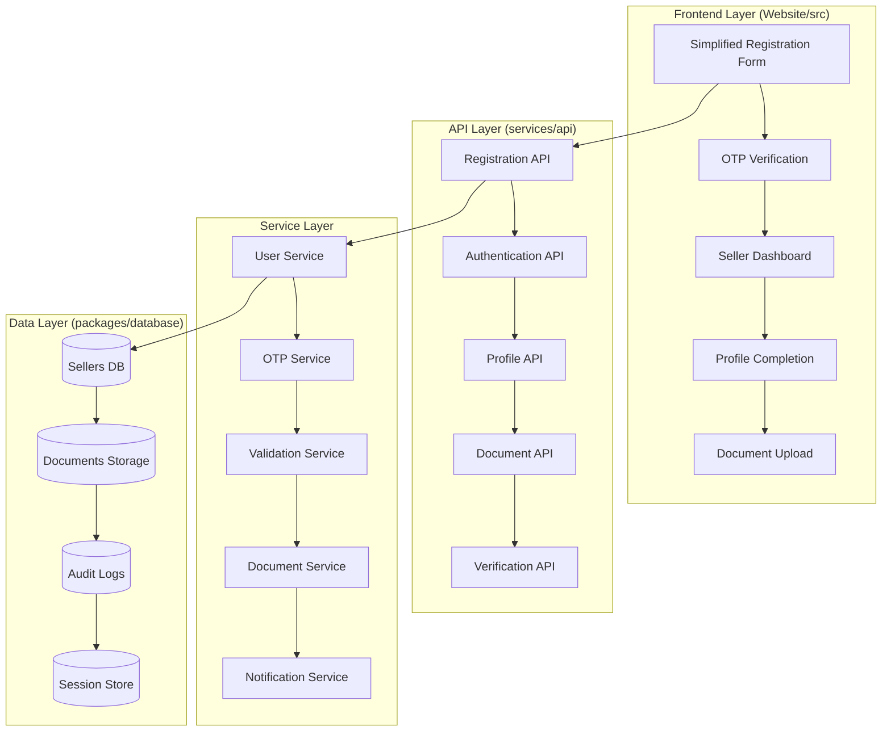

# Design Document

## Overview

This design document outlines the architecture and implementation approach for the simplified seller registration system. The system prioritizes user experience with a minimal 4-field registration form, immediate account access, and progressive profile completion - following industry best practices from platforms like Flipkart and Amazon.

The design emphasizes security, compliance with Indian marketplace regulations, and scalability while maintaining simplicity for end users.

## Architecture

### High-Level Architecture



### Current State Analysis and Refactoring Strategy

**Existing Components to Refactor:**
1. **Website/src/components/Registration/SellerForm.tsx** - Currently implements a 3-step form with business details, contact info, and operations. This needs to be replaced with a simplified 4-field form as per requirements.

2. **services/api/src/routes/v1/seller-registration.routes.ts** - API routes are defined but contain placeholder implementations. These need to be completed with actual service implementations.

3. **Website/src/config/api.ts** - API endpoints are configured but some are misaligned with the new simplified flow.

**Components to Delete/Replace:**
- Current multi-step SellerForm.tsx (replace with simplified version)
- Unused API endpoints that don't align with simplified flow
- Any hardcoded or mock data in existing implementations

**Components to Enhance:**
- Database schema (packages/database) to support simplified seller model
- Shared types (packages/shared) to align with new requirements
- API service implementations to replace placeholder code

### System Components

1. **Frontend Components (Website/src/components)**
   - **NEW:** Simplified 4-field registration form (replaces existing SellerForm)
   - **NEW:** OTP verification interface with mobile optimization
   - **NEW:** Seller dashboard with progress tracking
   - **NEW:** Progressive profile completion forms
   - **NEW:** Document upload interface with mobile camera support
   - **ENHANCE:** Existing trust indicators and branding components

2. **Backend Services (services/api/src)**
   - **COMPLETE:** Registration and authentication service (currently placeholder)
   - **COMPLETE:** OTP generation and verification service (currently placeholder)
   - **NEW:** Document management and verification service
   - **NEW:** Notification service (SMS/Email)
   - **NEW:** Admin management interface
   - **NEW:** Fraud detection and risk scoring service
   - **NEW:** Audit and compliance service

3. **Data Storage (packages/database)**
   - **ENHANCE:** PostgreSQL schema for simplified seller model
   - **NEW:** Document storage with versioning and encryption
   - **NEW:** Redis for session management and OTP storage
   - **NEW:** Audit log storage for compliance
   - **NEW:** Risk scoring and fraud detection data

4. **External Integrations**
   - **NEW:** SMS gateway for OTP delivery
   - **NEW:** Email service for notifications
   - **PLACEHOLDER:** Payment gateway integration
   - **FUTURE:** Government API integration (GST/PAN validation)

### Production-Ready Implementation Strategy

**Phase 1: Core Registration (Replace Existing)**
- Replace current SellerForm with simplified 4-field version
- Implement actual OTP service (no mocks)
- Complete seller registration API with database integration
- Add proper validation and error handling

**Phase 2: Authentication & Security**
- Implement JWT token management
- Add rate limiting and abuse protection
- Complete login/logout functionality
- Add password reset with OTP/email options

**Phase 3: Progressive Profile & Documents**
- Build seller dashboard with real completion tracking
- Implement document upload with actual file storage
- Add admin verification interface
- Complete audit trail implementation

**Phase 4: Compliance & Production Features**
- Add PAN/GST validation with real algorithms
- Implement backup and disaster recovery
- Add comprehensive monitoring and alerting
- Complete all security and compliance features

## Security Architecture

### Token Management Strategy

```typescript
interface TokenConfiguration {
  accessToken: {
    expiryTime: '15 minutes';
    algorithm: 'RS256';
    issuer: 'shambit-seller-auth';
  };
  refreshToken: {
    expiryTime: '7 days';
    rotationStrategy: 'on_use';
    reuseDetection: true;
    family: 'token_family_id';
  };
  logout: {
    invalidateAll: true;
    blacklistDuration: '7 days';
  };
}
```

### Admin Role-Based Access Control

```typescript
interface AdminRoles {
  superadmin: {
    permissions: ['*'];
    description: 'Full system access';
  };
  reviewer: {
    permissions: ['seller.view', 'document.review', 'seller.approve'];
    description: 'Seller verification and approval';
  };
  verifier: {
    permissions: ['document.verify', 'document.reject'];
    description: 'Document verification only';
  };
  auditor: {
    permissions: ['audit.view', 'reports.generate'];
    description: 'Read-only audit and reporting';
  };
}
```

### Fraud Detection Architecture

```typescript
interface FraudDetectionService {
  riskScoring: {
    deviceFingerprinting: boolean;
    behaviorAnalysis: boolean;
    velocityChecks: boolean;
    blacklistChecking: boolean;
  };
  ruleEngine: {
    suspiciousPatterns: string[];
    autoSuspendThreshold: number;
    manualReviewThreshold: number;
  };
  escalation: {
    autoSuspend: boolean;
    notifyAdmin: boolean;
    requireManualReview: boolean;
  };
}
```

## Components and Interfaces

### Frontend Components

#### 1. Simplified Registration Form Component (REPLACES existing SellerForm.tsx)
```typescript
interface RegistrationFormData {
  fullName: string;
  mobile: string;
  email: string;
  password: string;
}

interface RegistrationFormProps {
  onSubmit: (data: RegistrationFormData) => Promise<void>;
  loading: boolean;
  errors: Record<string, string>;
  showTrustIndicators: boolean;
  mobileOptimized: boolean;
}

interface ValidationRules {
  mobile: {
    pattern: /^[6-9]\d{9}$/; // Indian mobile numbers
    message: 'Enter valid 10-digit mobile number starting with 6-9';
  };
  password: {
    minLength: 8;
    requireMixed: true;
    requireNumbers: true;
    requireSpecialChars: true;
    strengthIndicator: boolean;
  };
  email: {
    pattern: /^[^\s@]+@[^\s@]+\.[^\s@]+$/;
    message: 'Enter a valid email address';
  };
}

// Design Decision: Replace the existing 3-step form with a single-step 4-field form
// Rationale: Requirements specify exactly 4 fields for minimal friction
// Implementation: Reuse existing styling and branding from current SellerForm
```

#### 2. OTP Verification Component (NEW)
```typescript
interface OTPVerificationProps {
  mobile: string;
  onVerify: (otp: string) => Promise<void>;
  onResend: () => Promise<void>;
  timeRemaining: number;
  loading: boolean;
  attemptsRemaining: number;
  cooldownActive: boolean;
  fallbackOptions: {
    whatsapp: boolean;
    email: boolean;
  };
}

interface OTPConfig {
  length: 6;
  expiryMinutes: 5;
  maxAttempts: 3;
  cooldownMinutes: 30;
  autoFocus: boolean;
  numericKeypad: boolean;
}

// Design Decision: Add WhatsApp fallback for OTP delivery
// Rationale: Improve delivery reliability in areas with poor SMS service
```

#### 3. Seller Dashboard Component (NEW)
```typescript
interface SellerDashboardProps {
  seller: SellerProfile;
  completionProgress: ProfileCompletionStatus;
  onNavigateToSection: (section: string) => void;
  welcomeMessage: boolean;
  onboardingGuide: boolean;
  slaTimelines: ServiceLevelAgreements;
}

interface ProfileCompletionStatus {
  basicInfo: boolean;
  businessDetails: boolean;
  addressInfo: boolean;
  taxCompliance: boolean;
  bankDetails: boolean;
  documentVerification: boolean;
  overallProgress: number;
  requiredSections: string[];
  optionalSections: string[];
  unlockedFeatures: string[];
  nextSteps: string[];
}

// Design Decision: Progressive disclosure of profile sections
// Rationale: Reduce cognitive load while maintaining comprehensive data collection
```

#### 4. Enhanced API Configuration (UPDATE existing api.ts)
```typescript
// Update existing API_ENDPOINTS to align with simplified flow
export const API_ENDPOINTS = {
  SELLER_REGISTRATION: {
    REGISTER: `${API_BASE_URL}/seller-registration/register`,
    VERIFY_OTP: `${API_BASE_URL}/seller-registration/verify-otp`,
    RESEND_OTP: `${API_BASE_URL}/seller-registration/resend-otp`,
    PROFILE_UPDATE: `${API_BASE_URL}/seller-registration/profile`,
    PROFILE_STATUS: `${API_BASE_URL}/seller-registration/profile/status`,
  },
  // Remove or deprecate endpoints that don't align with simplified flow
  SELLERS: {
    // Keep only endpoints that are actually used
    STATISTICS: `${API_BASE_URL}/sellers/statistics/overview`,
  },
  // Keep existing SMS and SELLER_AUTH endpoints as they may be used elsewhere
  SMS: {
    SEND_OTP: `${API_BASE_URL}/sms/send-otp`,
    VERIFY_OTP: `${API_BASE_URL}/sms/verify-otp`,
  },
  SELLER_AUTH: {
    LOGIN: `${API_BASE_URL}/seller-auth/login`,
    FORGOT_PASSWORD: `${API_BASE_URL}/seller-auth/forgot-password`,
    RESET_PASSWORD: `${API_BASE_URL}/seller-auth/reset-password`,
  },
  HEALTH: `${API_BASE_URL.replace('/api/v1', '')}/health`,
} as const;

// Design Decision: Consolidate registration endpoints under /seller-registration
// Rationale: Clear separation of concerns and easier maintenance
```

### Backend API Interfaces

#### 1. Registration API (COMPLETE existing placeholder implementation)
```typescript
// POST /api/v1/seller-registration/register
interface RegistrationRequest {
  fullName: string;
  mobile: string;
  email: string;
  password: string;
  deviceFingerprint?: string;
  ipAddress: string;
  userAgent: string;
}

interface RegistrationResponse {
  success: boolean;
  data: {
    sellerId: string;
    otpSent: boolean;
    expiresIn: number;
    rateLimitInfo: {
      remaining: number;
      resetTime: number;
    };
  };
}

// Design Decision: Complete the existing placeholder implementation
// Rationale: API structure is already defined, just needs actual service integration
// Current State: Placeholder returns hardcoded values, needs database integration
```

#### 2. OTP Verification API (COMPLETE existing placeholder implementation)
```typescript
// POST /api/v1/seller-registration/verify-otp
interface OTPVerificationRequest {
  mobile: string;
  otp: string;
  deviceFingerprint?: string;
}

interface OTPVerificationResponse {
  success: boolean;
  data: {
    verified: boolean;
    tokens: {
      accessToken: string;
      refreshToken: string;
    };
    seller: SellerBasicInfo;
    welcomeFlow: boolean;
  };
}

// POST /api/v1/seller-registration/resend-otp (ENHANCE existing)
interface OTPResendRequest {
  mobile: string;
  method: 'sms' | 'whatsapp';
}

interface OTPResendResponse {
  success: boolean;
  data: {
    sent: boolean;
    expiresIn: number;
    attemptsRemaining: number;
    cooldownSeconds?: number;
  };
}

// Design Decision: Add WhatsApp method to existing resend endpoint
// Rationale: Improve OTP delivery reliability
// Current State: Basic implementation exists, needs method parameter and actual SMS service
```

#### 3. Authentication API (NEW - separate from existing seller-auth)
```typescript
// POST /api/v1/seller-registration/login
interface LoginRequest {
  identifier: string; // email or mobile
  password: string;
  deviceFingerprint?: string;
  ipAddress: string;
}

interface LoginResponse {
  success: boolean;
  data: {
    tokens: {
      accessToken: string;
      refreshToken: string;
    };
    seller: SellerProfile;
    requiresAdditionalVerification: boolean;
    rateLimitInfo: {
      remaining: number;
      lockoutSeconds?: number;
    };
  };
}

// Design Decision: Create new login endpoint specifically for simplified registration flow
// Rationale: Separate concerns from existing seller-auth which may have different requirements
// Current State: Existing seller-auth endpoints exist but may not align with simplified flow
```

#### 4. Profile Completion API (ENHANCE existing implementation)
```typescript
// PUT /api/v1/seller-registration/profile (ENHANCE existing)
interface ProfileUpdateRequest {
  section: 'business' | 'address' | 'tax' | 'bank';
  data: Record<string, any>;
  partialSave: boolean;
}

interface ProfileUpdateResponse {
  success: boolean;
  data: {
    updated: boolean;
    completionStatus: ProfileCompletionStatus;
    unlockedFeatures: string[];
    nextSteps: string[];
  };
}

// GET /api/v1/seller-registration/profile/status (ENHANCE existing)
interface CompletionStatusResponse {
  success: boolean;
  data: {
    progress: ProfileCompletionStatus;
    slaTimelines: ServiceLevelAgreements;
    productListingEligible: boolean;
    payoutEligible: boolean;
  };
}

// Design Decision: Enhance existing profile endpoints with feature access logic
// Rationale: Existing structure is good, just needs business logic implementation
// Current State: Basic structure exists, needs actual profile completion tracking
```

#### 5. Document Management API (NEW)
```typescript
// POST /api/v1/seller-registration/documents/upload
interface DocumentUploadRequest {
  type: 'pan_card' | 'gst_certificate' | 'bank_proof' | 'aadhaar' | 'business_certificate' | 'address_proof' | 'udyam_certificate';
  file: File;
  metadata: {
    fileName: string;
    fileSize: number;
    mimeType: string;
  };
}

interface DocumentUploadResponse {
  success: boolean;
  data: {
    documentId: string;
    uploadUrl?: string;
    verificationStatus: 'pending' | 'processing';
    estimatedReviewTime: string;
  };
}

// Design Decision: Create new document management endpoints
// Rationale: No existing document handling in current codebase
// Current State: Needs to be built from scratch with proper file storage
```

#### 6. Admin Management API (NEW)
```typescript
// GET /api/v1/admin/sellers
interface AdminSellerListRequest {
  status?: 'pending' | 'verified' | 'rejected' | 'suspended';
  verificationStatus?: 'pending' | 'in_review' | 'verified' | 'rejected';
  page: number;
  limit: number;
  sortBy: string;
}

// PUT /api/v1/admin/sellers/:id/status
interface AdminSellerStatusUpdate {
  status: 'approved' | 'rejected' | 'suspended';
  reason?: string;
  adminId: string;
  notifySeller: boolean;
}

// Design Decision: Create admin interface for seller management
// Rationale: No existing admin functionality for seller verification
// Current State: Needs to be built from scratch
```

#### 7. Analytics and Monitoring API (NEW)
```typescript
// POST /api/v1/analytics/track
interface AnalyticsEvent {
  event: 'registration_started' | 'registration_completed' | 'registration_abandoned' | 'otp_requested' | 'login_attempt';
  sellerId?: string;
  sessionId: string;
  timestamp: Date;
  metadata: Record<string, any>;
  exitPoint?: string;
  completionTime?: number;
}

// Design Decision: Add analytics tracking for registration funnel
// Rationale: Requirements specify tracking conversion rates and user behavior
// Current State: No existing analytics implementation
```

## Data Models

### Core Seller Model
```typescript
interface Seller {
  id: string;
  
  // Basic Registration Data (Required)
  fullName: string;
  mobile: string;
  email: string;
  passwordHash: string;
  
  // Verification Status
  mobileVerified: boolean;
  emailVerified: boolean;
  
  // Profile Completion (Optional initially)
  businessDetails?: {
    businessName?: string;
    businessType?: 'individual' | 'proprietorship' | 'partnership' | 'llp' | 'private_limited';
    natureOfBusiness?: string;
    yearOfEstablishment?: number;
    primaryProductCategories?: string;
  };
  
  addressInfo?: {
    registeredAddress: Address;
    warehouseAddresses: Address[];
  };
  
  taxCompliance?: {
    panNumber?: string;
    panHolderName?: string;
    gstRegistered: boolean;
    gstNumber?: string;
    aadhaarNumber?: string;
    // Non-GST seller support
    gstExempt?: boolean;
    exemptionReason?: 'turnover_below_threshold' | 'exempt_goods' | 'composition_scheme';
    turnoverDeclaration?: number;
  };
  
  bankDetails?: {
    accountHolderName: string;
    bankName: string;
    accountNumber: string;
    ifscCode: string;
    accountType: 'savings' | 'current';
    verificationStatus: 'pending' | 'verified' | 'rejected';
    verificationMethod: 'cancelled_cheque' | 'bank_statement';
  };
  
  // Risk and Fraud Detection
  riskScore?: number;
  riskFlags?: string[];
  lastRiskAssessment?: Date;
  deviceFingerprints?: string[];
  suspiciousActivityFlags?: string[];
  
  // Account Management
  accountStatus: 'active' | 'deactivated' | 'deleted';
  deactivationReason?: string;
  deactivatedAt?: Date;
  deletionScheduledAt?: Date;
  dataExportRequested?: boolean;
  
  // System Fields
  status: 'active' | 'suspended' | 'deactivated';
  verificationStatus: 'pending' | 'in_review' | 'verified' | 'rejected';
  canListProducts: boolean;
  payoutEnabled: boolean;
  
  // Feature Access Control
  featureAccess: {
    productListing: boolean;
    payoutProcessing: boolean;
    bulkOperations: boolean;
    advancedAnalytics: boolean;
  };
  
  // Service Level Tracking
  slaTracking: {
    documentSubmissionDate?: Date;
    reviewStartDate?: Date;
    reviewCompletionDate?: Date;
    payoutSetupDate?: Date;
    escalationLevel: number;
  };
  
  // Audit Fields
  createdAt: Date;
  updatedAt: Date;
  lastLoginAt?: Date;
  loginAttempts: number;
  lastFailedLoginAt?: Date;
  accountLockedUntil?: Date;
}

interface Address {
  line1: string;
  line2?: string;
  city: string;
  state: string;
  pincode: string;
  country: 'India';
  landmark?: string;
  addressType: 'registered' | 'warehouse' | 'pickup';
}
```

### Enhanced Document Model with Versioning
```typescript
interface Document {
  id: string;
  sellerId: string;
  type: 'pan_card' | 'gst_certificate' | 'bank_proof' | 'aadhaar' | 'business_certificate' | 'address_proof' | 'udyam_certificate';
  fileName: string;
  fileUrl: string;
  fileHash: string;
  fileSize: number;
  mimeType: string;
  version: number;
  previousVersions?: DocumentVersion[];
  uploadedAt: Date;
  verificationStatus: 'pending' | 'processing' | 'verified' | 'rejected';
  verifiedBy?: string;
  verifiedAt?: Date;
  rejectionReason?: string;
  checksumValidated: boolean;
  corruptionDetected: boolean;
  qualityScore?: number;
  extractedData?: Record<string, any>;
  
  // Audit Trail
  auditTrail: DocumentAuditEntry[];
  retentionPolicy: {
    retainUntil: Date;
    legalHoldStatus: boolean;
  };
}

interface DocumentVersion {
  version: number;
  fileUrl: string;
  fileHash: string;
  uploadedAt: Date;
  replacedReason: string;
}

interface DocumentAuditEntry {
  id: string;
  action: 'uploaded' | 'verified' | 'rejected' | 'replaced' | 'downloaded' | 'deleted';
  performedBy: string;
  performedAt: Date;
  reason?: string;
  metadata?: Record<string, any>;
  ipAddress: string;
  userAgent: string;
}
```

### Rate Limiting and Security Models
```typescript
interface RateLimitRecord {
  id: string;
  identifier: string; // IP address, mobile number, or user ID
  identifierType: 'ip' | 'mobile' | 'user' | 'device';
  endpoint: string;
  requestCount: number;
  windowStart: Date;
  windowEnd: Date;
  blocked: boolean;
  blockedUntil?: Date;
  createdAt: Date;
  updatedAt: Date;
}

interface SecurityEvent {
  id: string;
  sellerId?: string;
  eventType: 'login_failure' | 'otp_abuse' | 'suspicious_device' | 'rate_limit_exceeded' | 'account_locked';
  severity: 'low' | 'medium' | 'high' | 'critical';
  ipAddress: string;
  userAgent: string;
  deviceFingerprint?: string;
  metadata: Record<string, any>;
  resolved: boolean;
  resolvedBy?: string;
  resolvedAt?: Date;
  createdAt: Date;
}

interface DeviceFingerprint {
  id: string;
  sellerId?: string;
  fingerprint: string;
  firstSeen: Date;
  lastSeen: Date;
  trusted: boolean;
  riskScore: number;
  associatedAccounts: string[];
  metadata: {
    userAgent: string;
    screenResolution: string;
    timezone: string;
    language: string;
    platform: string;
  };
}
```

### Analytics and Monitoring Models
```typescript
interface RegistrationAnalytics {
  id: string;
  sessionId: string;
  sellerId?: string;
  event: 'started' | 'form_filled' | 'otp_sent' | 'otp_verified' | 'completed' | 'abandoned';
  timestamp: Date;
  exitPoint?: string;
  completionTime?: number;
  errorEncountered?: string;
  deviceType: 'mobile' | 'desktop' | 'tablet';
  source: string;
  metadata: Record<string, any>;
}

interface ConversionFunnel {
  date: Date;
  started: number;
  formFilled: number;
  otpSent: number;
  otpVerified: number;
  completed: number;
  conversionRate: number;
  averageCompletionTime: number;
  commonExitPoints: string[];
}
```

### Admin and Compliance Models
```typescript
interface AdminUser {
  id: string;
  username: string;
  email: string;
  role: 'superadmin' | 'reviewer' | 'verifier' | 'auditor';
  permissions: string[];
  active: boolean;
  lastLoginAt?: Date;
  createdAt: Date;
  updatedAt: Date;
}

interface ComplianceRecord {
  id: string;
  sellerId: string;
  complianceType: 'kyc' | 'tax' | 'bank' | 'document';
  status: 'compliant' | 'non_compliant' | 'pending' | 'expired';
  lastChecked: Date;
  nextReviewDate: Date;
  violations?: string[];
  remedialActions?: string[];
  complianceOfficer?: string;
}
```

### Payout Integration Model (Enhanced)
```typescript
interface PayoutService {
  eligibilityCheck: {
    kycVerified: boolean;
    bankVerified: boolean;
    riskScoreAcceptable: boolean;
    complianceCleared: boolean;
    panVerified: boolean;
    gstCompliant: boolean;
    minimumVerificationLevel: 'basic' | 'enhanced';
  };
  payoutRequest: {
    sellerId: string;
    amount: number;
    currency: 'INR';
    bankAccountId: string;
    taxDeductions: number;
    processingFee: number;
    complianceChecks: {
      panStatus: 'verified' | 'pending' | 'rejected';
      gstStatus: 'verified' | 'pending' | 'not_required';
      riskAssessment: 'low' | 'medium' | 'high';
    };
  };
  reconciliation: {
    transactionId: string;
    gatewayReference: string;
    status: 'pending' | 'processed' | 'failed' | 'reversed';
    processedAt?: Date;
    auditTrail: PayoutAuditEntry[];
  };
}

interface PayoutAuditEntry {
  action: string;
  performedBy: string;
  timestamp: Date;
  verificationStatus: Record<string, any>;
  complianceFlags: string[];
}
```

### File Storage Integrity Model (Enhanced)
```typescript
interface FileStorageConfig {
  checksumValidation: {
    algorithm: 'SHA-256';
    validateOnUpload: true;
    validateOnDownload: true;
    validateOnAccess: true;
  };
  versioning: {
    retentionCount: 5;
    maxVersionAge: '2 years';
    compressionEnabled: true;
    automaticCleanup: true;
  };
  redundancy: {
    replicationFactor: 3;
    crossRegionBackup: true;
    corruptionDetection: true;
    autoRepair: true;
    integrityChecks: 'daily';
  };
  restoration: {
    pointInTimeRecovery: true;
    maxRecoveryAge: '1 year';
    restoreNotification: true;
    auditRestoreRequests: true;
  };
  compliance: {
    dataRetentionPeriod: '7 years';
    legalHoldSupport: true;
    gdprCompliance: true;
    indianDataLaws: true;
  };
}
```

### Enhanced Audit Log Model
```typescript
interface AuditLog {
  id: string;
  sellerId?: string;
  adminId?: string;
  action: string;
  entityType: 'seller' | 'document' | 'profile' | 'payout' | 'security';
  entityId: string;
  oldValues?: Record<string, any>;
  newValues?: Record<string, any>;
  performedBy: string;
  performedAt: Date;
  ipAddress: string;
  userAgent: string;
  sessionId?: string;
  riskLevel: 'low' | 'medium' | 'high';
  complianceRelevant: boolean;
  retentionPeriod: Date;
  
  // Enhanced tracking
  businessJustification?: string;
  approvalRequired: boolean;
  approvedBy?: string;
  approvedAt?: Date;
  
  // Compliance fields
  regulatoryReporting: boolean;
  dataClassification: 'public' | 'internal' | 'confidential' | 'restricted';
  legalHold: boolean;
}
```

## API Versioning Strategy

```typescript
interface APIVersioning {
  strategy: 'URI_versioning';
  currentVersion: 'v1';
  baseUrl: '/api/v1';
  deprecationPolicy: {
    noticePeriod: '6 months';
    supportPeriod: '12 months';
    migrationGuide: true;
  };
  backwardCompatibility: {
    additive: true; // New fields allowed
    breaking: false; // No breaking changes within version
    sunset: '2026-01-01'; // v1 sunset date
  };
  rateLimiting: {
    perEndpoint: true;
    globalLimits: true;
    headerSupport: true;
  };
}
```

## Enhanced Rate Limiting Strategy

```typescript
interface RateLimitingConfiguration {
  endpoints: {
    registration: {
      limit: 5;
      window: '1 hour';
      identifier: 'ip';
      blockDuration: '1 hour';
    };
    login: {
      limit: 10;
      window: '15 minutes';
      identifier: 'ip';
      progressiveDelay: true;
      accountLockout: {
        threshold: 5;
        duration: '30 minutes';
      };
    };
    otpRequest: {
      limit: 3;
      window: '10 minutes';
      identifier: 'mobile';
      cooldown: '30 minutes';
      deviceFingerprinting: true;
    };
    apiGeneral: {
      limit: 100;
      window: '1 minute';
      identifier: 'user';
      burstAllowance: 20;
    };
  };
  dynamicLimiting: {
    enabled: true;
    suspiciousPatternDetection: true;
    automaticAdjustment: true;
    distributedAttackProtection: true;
  };
  monitoring: {
    alertThresholds: {
      highTraffic: '80% of limit';
      suspiciousActivity: 'pattern-based';
      systemOverload: 'resource-based';
    };
    logging: {
      allAttempts: true;
      blockedRequests: true;
      rateLimitHeaders: true;
    };
  };
}
```

## Mobile-First Design Architecture

```typescript
interface MobileOptimization {
  responsive: {
    breakpoints: {
      mobile: '320px - 768px';
      tablet: '768px - 1024px';
      desktop: '1024px+';
    };
    touchTargets: {
      minimumSize: '44px';
      spacing: '8px';
      accessibility: 'WCAG 2.1 AA';
    };
  };
  performance: {
    targetLoadTime: '3 seconds on 3G';
    imageOptimization: true;
    lazyLoading: true;
    caching: 'aggressive';
    bundleSplitting: true;
  };
  inputOptimization: {
    appropriateKeyboards: {
      tel: 'mobile numbers';
      email: 'email addresses';
      numeric: 'OTP input';
    };
    autoFocus: true;
    autoComplete: true;
    validation: 'real-time';
  };
  offline: {
    serviceWorker: true;
    dataPreservation: true;
    offlineIndicator: true;
    syncOnReconnect: true;
  };
}
```

## Logging and Observability

```typescript
interface LoggingConfiguration {
  structuredLogging: {
    format: 'JSON';
    fields: ['timestamp', 'level', 'service', 'traceId', 'sellerId', 'action', 'duration', 'ipAddress', 'userAgent'];
    levels: ['ERROR', 'WARN', 'INFO', 'DEBUG'];
    sensitiveDataMasking: true;
  };
  retention: {
    errorLogs: '1 year';
    auditLogs: '7 years';
    accessLogs: '90 days';
    debugLogs: '30 days';
    securityLogs: '2 years';
    complianceLogs: '7 years';
  };
  alerting: {
    errorRate: '>5% in 5 minutes';
    responseTime: '>2s for 95th percentile';
    registrationFailures: '>10% in 10 minutes';
    otpFailures: '>20% in 5 minutes';
    securityEvents: 'immediate';
    complianceViolations: 'immediate';
  };
  tracing: {
    traceIdGeneration: 'UUID4';
    propagation: 'HTTP headers';
    sampling: '10% for normal, 100% for errors';
    correlationIds: true;
  };
  monitoring: {
    businessMetrics: {
      registrationConversion: 'real-time';
      verificationTimes: 'hourly';
      supportTickets: 'daily';
      fraudDetection: 'real-time';
    };
    systemMetrics: {
      apiLatency: 'real-time';
      errorRates: 'real-time';
      throughput: 'real-time';
      resourceUtilization: 'minute';
    };
  };
}
```

## Disaster Recovery and Business Continuity

```typescript
interface DisasterRecoveryConfiguration {
  backupStrategy: {
    frequency: 'daily';
    encryption: 'AES-256';
    offsite: true;
    crossRegion: true;
    retention: {
      daily: '30 days';
      weekly: '12 weeks';
      monthly: '12 months';
      yearly: '7 years';
    };
  };
  recoveryObjectives: {
    rto: '24 hours'; // Recovery Time Objective
    rpo: '4 hours';  // Recovery Point Objective
    mttr: '2 hours'; // Mean Time To Recovery
  };
  testing: {
    frequency: 'quarterly';
    fullSystemTest: 'annually';
    documentationUpdate: 'after each test';
    stakeholderNotification: true;
  };
  continuity: {
    alternativeProcesses: true;
    manualFallbacks: true;
    communicationPlan: true;
    vendorContacts: true;
  };
}
```

## Correctness Properties

*A property is a characteristic or behavior that should hold true across all valid executions of a system-essentially, a formal statement about what the system should do. Properties serve as the bridge between human-readable specifications and machine-verifiable correctness guarantees.*

### Property-Based Testing Analysis

Based on the requirements analysis, the following acceptance criteria are suitable for property-based testing:

**Testable Properties:**
- Registration data validation (Requirements 1.3, 1.4, 1.5)
- Account creation and authentication (Requirements 1.2, 3.1, 3.2, 7.1, 7.2)
- OTP generation and verification (Requirements 2.1, 2.2, 2.3, 2.4, 2.5)
- Rate limiting enforcement (Requirements 12.1, 12.2, 22.1, 24.1, 24.2)
- Data encryption and security (Requirements 8.2, 21.1, 21.2, 21.4)
- Duplicate prevention (Requirements 8.4, 14.1, 14.2)
- Document validation (Requirements 26.1, 26.2)

**Examples/Edge Cases:**
- Registration form field display (Requirements 1.1)
- Mobile number format validation edge cases
- Password strength requirements edge cases
- OTP expiration handling
- Account lockout scenarios

**Non-testable (UI/UX focused):**
- Professional design appearance
- Mobile responsiveness
- Loading state displays
- Error message clarity

### Property Reflection

After analyzing all testable properties, I've identified the following consolidations to eliminate redundancy:

- Properties 8.2 and 21.2 both test password hashing - consolidated into Property 9
- Properties 8.4, 14.1, and 14.2 all test duplicate prevention - consolidated into Property 8
- Rate limiting properties can be grouped by type for better coverage

### Core Properties

#### Property 1: Registration Data Validation
*For any* registration attempt with invalid data (malformed email, invalid mobile format, weak password), the system should reject the registration and return specific validation errors without creating an account.
**Validates: Requirements 1.3, 1.4, 1.5**

#### Property 2: Valid Registration Account Creation
*For any* valid registration data, the system should create an active seller account immediately without requiring admin approval and automatically log in the user.
**Validates: Requirements 1.2, 3.1, 3.2**

#### Property 3: OTP Generation and Verification Lifecycle
*For any* valid mobile number, generating an OTP should send a 6-digit code, verifying with the correct code within 5 minutes should mark the mobile as verified, incorrect codes should fail with error messages, and expired OTPs should allow new requests while invalidating previous ones.
**Validates: Requirements 2.1, 2.2, 2.3, 2.4, 2.5**

#### Property 4: Authentication Token Management
*For any* valid login credentials, the system should verify the credentials and generate secure JWT tokens, while invalid credentials should be rejected with appropriate error messages.
**Validates: Requirements 7.1, 7.2**

#### Property 5: OTP Rate Limiting and Cooldown
*For any* mobile number, exceeding 3 OTP requests within 10 minutes should trigger rate limiting, and after rate limit is exceeded, a 30-minute cooldown should be enforced before allowing new requests.
**Validates: Requirements 12.1, 12.2**

#### Property 6: Account Lockout Protection
*For any* user account, failing login 5 times within 15 minutes should temporarily lock the account for 30 minutes, preventing further login attempts during the lockout period.
**Validates: Requirements 22.1**

#### Property 7: API Rate Limiting
*For any* IP address, exceeding registration limits (5 per hour) or login limits (10 per 15 minutes) should result in rate limiting errors, while requests within limits should succeed.
**Validates: Requirements 24.1, 24.2**

#### Property 8: Duplicate Account Prevention
*For any* attempt to register with an already-used email or mobile number, the system should prevent account creation and return appropriate error messages indicating the conflict.
**Validates: Requirements 8.4, 14.1, 14.2**

#### Property 9: Password Security and Encryption
*For any* password stored in the system, it should be hashed using bcrypt with minimum 12 salt rounds, and original passwords should never be retrievable.
**Validates: Requirements 8.2, 21.2**

#### Property 10: Data Encryption Standards
*For any* sensitive data (bank account details), the system should encrypt the data using AES-256 encryption before storage, and all communications should use HTTPS/TLS encryption.
**Validates: Requirements 21.1, 21.4**

#### Property 11: PAN Number Validation
*For any* PAN number provided by a seller, the system should validate the format (5 letters, 4 digits, 1 letter) and apply check digit algorithm validation.
**Validates: Requirements 26.1**

#### Property 12: GST Number Validation and Cross-Check
*For any* GST number provided by a seller, the system should validate the 15-character format and cross-check that the embedded PAN matches the seller's PAN number.
**Validates: Requirements 26.2**

## Error Handling

### Error Categories

1. **Validation Errors**
   - Invalid input format (email, mobile, PAN, GST)
   - Missing required fields
   - Password strength violations
   - File format/size violations
   - Mobile number format (Indian numbers: 10 digits starting with 6-9)

2. **Business Logic Errors**
   - Duplicate account attempts (email/mobile already exists)
   - Rate limit exceeded (OTP, registration, login)
   - Account status violations (suspended, deactivated)
   - Verification failures (OTP incorrect/expired)
   - Feature access denied (product listing, payout processing)

3. **System Errors**
   - Database connection failures
   - External service unavailability (SMS, email, payment gateway)
   - File storage failures
   - Authentication service errors
   - Network timeouts and connectivity issues

4. **Security Errors**
   - Suspicious activity detection
   - Brute force attempts and account lockouts
   - Invalid tokens and session expiry
   - Unauthorized access attempts
   - Device fingerprinting anomalies

5. **Compliance Errors**
   - KYC document verification failures
   - Tax compliance violations
   - Data retention policy violations
   - Audit trail inconsistencies

### Error Response Format

```typescript
interface ErrorResponse {
  success: false;
  error: {
    code: string;
    message: string;
    details?: Record<string, any>;
    timestamp: string;
    requestId: string;
    retryable: boolean;
    supportContact?: string;
  };
  rateLimitInfo?: {
    remaining: number;
    resetTime: number;
    retryAfter?: number;
  };
}

interface ValidationErrorResponse extends ErrorResponse {
  error: {
    code: 'VALIDATION_ERROR';
    message: string;
    fieldErrors: Record<string, string[]>;
    suggestions?: Record<string, string>;
  };
}
```

### Error Handling Strategies

1. **Graceful Degradation**
   - Continue registration even if optional services fail (email verification)
   - Provide alternative verification methods (WhatsApp OTP fallback)
   - Cache data locally when possible to prevent data loss
   - Show partial functionality when some features are unavailable

2. **User-Friendly Messages**
   - Convert technical errors to user-understandable language
   - Provide actionable guidance for resolution
   - Include support contact information when needed
   - Show progress preservation ("Your data has been saved")

3. **Retry Mechanisms**
   - Automatic retry for transient failures (network issues)
   - Exponential backoff for external service calls
   - Manual retry options for user-initiated actions
   - Smart retry logic that avoids rate limits

4. **Recovery Options**
   - Account recovery suggestions for duplicate detection
   - Alternative contact methods when OTP fails
   - Data export before account deletion
   - Session recovery after network interruptions

5. **Monitoring and Alerting**
   - Log all errors with context and correlation IDs
   - Alert on critical error patterns and thresholds
   - Track error rates and trends for proactive fixes
   - Escalate SLA violations automatically

### Specific Error Scenarios

1. **OTP Service Failures**
   - SMS delivery failures → WhatsApp fallback
   - Rate limiting → Clear cooldown timers
   - Service unavailability → Alternative contact methods

2. **Registration Conflicts**
   - Duplicate email/mobile → Account recovery suggestions
   - Invalid data → Field-specific guidance
   - Rate limiting → Clear retry timelines

3. **Authentication Issues**
   - Account lockouts → Recovery options and timelines
   - Session expiry → Seamless re-authentication
   - Device verification → Clear verification steps

4. **Document Upload Problems**
   - File size/format issues → Clear requirements and examples
   - Upload failures → Resume capability
   - Verification delays → Status updates and timelines

## Testing Strategy

### Dual Testing Approach

The testing strategy combines unit testing and property-based testing to ensure comprehensive coverage:

**Unit Tests:**
- Specific examples and edge cases
- Integration points between components
- Error conditions and boundary cases
- UI component behavior
- API endpoint functionality
- Database operations

**Property-Based Tests:**
- Universal properties across all inputs
- Data validation rules
- Security constraints
- Business logic invariants
- Rate limiting enforcement
- Encryption and security properties

### Property-Based Testing Configuration

- **Testing Framework:** fast-check (JavaScript/TypeScript)
- **Minimum Iterations:** 100 per property test
- **Test Tagging:** Each property test must reference its design document property
- **Tag Format:** `Feature: simplified-seller-registration, Property {number}: {property_text}`

### Test Categories

1. **Registration Flow Tests**
   - Valid registration scenarios with various input combinations
   - Invalid input handling and validation
   - OTP verification flows and edge cases
   - Account creation verification
   - Mobile-first responsive behavior

2. **Security Tests**
   - Rate limiting enforcement across all endpoints
   - Authentication token handling and lifecycle
   - Data encryption verification (passwords, sensitive data)
   - Access control validation
   - Brute force protection
   - Device fingerprinting and abuse detection

3. **Profile Management Tests**
   - Progressive completion flows
   - Data persistence verification
   - Validation rule enforcement
   - Document upload handling
   - Feature access control based on completion status

4. **Admin Interface Tests**
   - Seller account management workflows
   - Document verification processes
   - Audit trail generation and integrity
   - Bulk operations and performance
   - Role-based access control

5. **Integration Tests**
   - End-to-end registration flows
   - External service integration (SMS, email, payment)
   - Database transaction handling
   - Error recovery scenarios
   - Cross-browser and cross-device compatibility

6. **Compliance and Audit Tests**
   - Data retention policy enforcement
   - Audit log completeness and accuracy
   - Regulatory compliance verification
   - Document versioning and integrity
   - Legal hold and data export functionality

7. **Analytics and Monitoring Tests**
   - Registration funnel tracking
   - Conversion rate measurement
   - Error rate monitoring
   - Performance metrics collection
   - Business intelligence data accuracy

### Performance Testing

- **Load Testing:** Support 1000 concurrent registrations
- **Stress Testing:** Graceful degradation under high load
- **Response Time:** API responses under 500ms (95th percentile)
- **Mobile Performance:** Page load under 3 seconds on 3G networks
- **Database Performance:** Query optimization and indexing
- **File Upload Performance:** Large document handling

### Security Testing

- **Penetration Testing:** Regular security assessments
- **Vulnerability Scanning:** Automated security scans
- **Data Protection:** Encryption and access control verification
- **Compliance Testing:** Indian data protection law compliance
- **Rate Limiting Testing:** Abuse prevention verification
- **Authentication Testing:** Token security and session management

### Mobile and Accessibility Testing

- **Responsive Design:** Cross-device compatibility
- **Touch Interface:** Mobile-optimized interactions
- **Accessibility:** WCAG 2.1 AA compliance
- **Performance:** 3G network optimization
- **Offline Capability:** Service worker functionality
- **Input Optimization:** Appropriate keyboards and auto-focus

### Disaster Recovery Testing

- **Backup Verification:** Regular backup integrity checks
- **Recovery Procedures:** Full system recovery testing
- **Data Consistency:** Cross-region replication verification
- **Failover Testing:** Automatic failover mechanisms
- **Business Continuity:** Alternative process validation

### Test Data Management

- **Synthetic Data:** Generated test data for various scenarios
- **Data Privacy:** No production data in testing
- **Test Isolation:** Independent test environments
- **Data Cleanup:** Automated test data cleanup
- **Compliance:** Test data retention policies

### Continuous Testing

- **CI/CD Integration:** Automated testing in deployment pipeline
- **Regression Testing:** Automated regression test suite
- **Smoke Testing:** Critical path verification
- **Canary Testing:** Gradual rollout verification
- **Monitoring Integration:** Production testing and monitoring