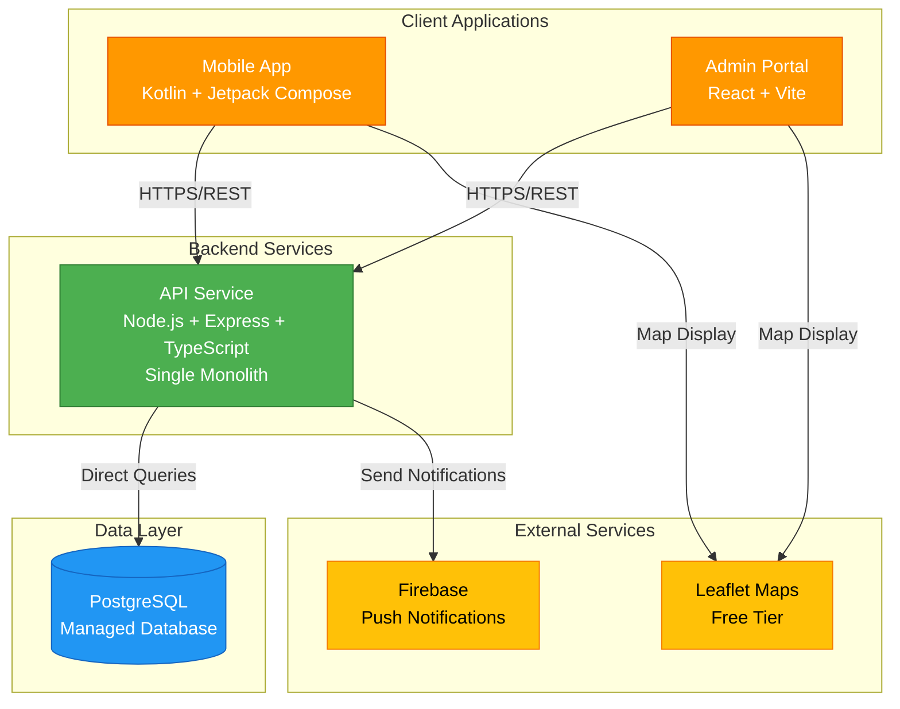

# ShamBit Platform

A simplified quick commerce platform built for startups. Clean, lean, and ready to scale.

## 🚀 Quick Start

### Development

```bash
# Install dependencies
npm install

# Set up environment variables
cp .env.example .env
# Edit .env with your configuration

# Run database migrations
npm run db:migrate

# Start development server
npm run dev
```

### Production Deployment (3 Steps!)

```bash
# 1. Push to GitHub
git push origin main

# 2. Connect Railway or Render to your repo
# 3. Deploy automatically - that's it!
```

See **[DEPLOYMENT.md](./DEPLOYMENT.md)** for complete deployment instructions.

**Supported Platforms:**
- ✅ Railway (Recommended) - ~$10/month
- ✅ Render - ~$14/month

Both platforms include:
- Managed PostgreSQL database
- Automatic SSL certificates
- Health check monitoring
- One-click deployment
- Automatic scaling
- **No Docker required!**

## 📚 Documentation

- **[Deployment Guide](./DEPLOYMENT.md)** - Complete deployment instructions for Railway and Render
- **[API Documentation](./services/api/README.md)** - Complete API reference with all endpoints
- **[API Quick Reference](./docs/API_QUICK_REFERENCE.md)** - Quick lookup for all API endpoints
- **[API Architecture](./docs/API_ARCHITECTURE.md)** - Detailed architecture and design decisions
- **[Simplification Changelog](./docs/SIMPLIFICATION_CHANGELOG.md)** - What was removed and why
- **[Monitoring Setup](./docs/MONITORING_SETUP.md)** - Free monitoring with UptimeRobot and platform tools
- **[Monitoring Quick Start](./docs/MONITORING_QUICK_START.md)** - 5-minute monitoring setup guide
- **[Environment Variables](./ENV_VARIABLES.md)** - Reference for all environment variables
- **[Admin Portal](./services/admin-portal/README.md)** - Admin portal documentation

## 🏗️ Architecture

### Simplified Architecture Diagram



### Simplified Stack

- **Backend**: Node.js + Express + TypeScript
- **Database**: PostgreSQL
- **Admin Portal**: React + Vite + TypeScript
- **Mobile App**: Kotlin + Jetpack Compose
- **Authentication**: JWT
- **Logging**: Winston with file rotation
- **Monitoring**: Health check endpoints + UptimeRobot

### What We Removed

This is a simplified version that removes enterprise complexity:

- ❌ Redis caching layer
- ❌ Batch/lot inventory tracking
- ❌ Separate delivery app service
- ❌ Analytics backend
- ❌ Docker production setup
- ❌ OpenTelemetry/Jaeger tracing
- ❌ Prometheus metrics
- ❌ Complex cron jobs
- ❌ Microservices architecture

### What We Kept

Focus on customer experience and core operations:

- ✅ Product catalog with search and filtering
- ✅ Simple inventory management
- ✅ Order management
- ✅ Delivery assignment (in admin portal)
- ✅ Promotions and offers
- ✅ Location features (Leaflet maps)
- ✅ Push notifications (Firebase)
- ✅ User authentication
- ✅ Basic logging and monitoring

## 📦 Project Structure

```
shambit-platform/
├── packages/
│   ├── config/          # Shared configuration
│   ├── database/        # Database migrations and models
│   └── shared/          # Shared utilities and types
├── services/
│   ├── api/            # Main API service
│   └── admin-portal/   # Admin web interface
├── mobile_app/         # Android mobile app
├── scripts/            # Utility scripts
├── .env.example        # Environment variables template
├── railway.json        # Railway deployment config
├── render.yaml         # Render deployment config
├── DEPLOYMENT.md       # Deployment guide
└── ENV_VARIABLES.md    # Environment variables reference
```

## 🔧 Available Scripts

### Root Level

```bash
# Development
npm run dev          # Start all services in development
npm run build        # Build all services for production
npm run test         # Run all tests
npm run lint         # Lint all code
npm run format       # Format code with Prettier

# Production
npm start            # Start API server (production)
npm run start:api    # Start API server only
npm run start:admin  # Preview admin portal build

# Database
npm run db:migrate   # Run database migrations
npm run db:rollback  # Rollback last migration
npm run db:seed      # Seed database with data

# Deployment & Security
npm run deploy:build    # Build everything and run migrations (for CI/CD)
npm run generate:secrets # Generate secure secrets for production
npm run security:audit   # Run security audit before deployment
npm run health:check     # Check API health status
```

### API Service

```bash
cd services/api
npm run dev          # Start API in development mode
npm run build        # Build TypeScript to JavaScript
npm start            # Start production server (requires build first)
npm run start:prod   # Start with NODE_ENV=production
npm run test         # Run tests
npm run lint         # Lint code
```

### Admin Portal

```bash
cd services/admin-portal
npm run dev          # Start dev server with hot reload
npm run build        # Build for production
npm run preview      # Preview production build locally
npm run lint         # Lint code
```

## 🔐 Environment Variables

See **[ENV_VARIABLES.md](./ENV_VARIABLES.md)** for complete reference.

### Quick Setup

1. Copy the example file:
   ```bash
   cp .env.example .env
   ```

2. Generate secrets:
   ```bash
   node -e "console.log(require('crypto').randomBytes(32).toString('hex'))"
   ```

3. Update Firebase credentials from Firebase Console

4. Configure database connection (or use defaults for local development)

## 🗄️ Database

### Local Development

```bash
# Install PostgreSQL
# Create database
createdb shambit_dev

# Run migrations
npm run db:migrate

# Seed data (optional)
npm run db:seed
```

### Production

Both Railway and Render provide managed PostgreSQL databases. See [DEPLOYMENT.md](./DEPLOYMENT.md) for setup instructions.

## 🏥 Health Monitoring

The API provides multiple health check endpoints:

- `GET /health` - Main health check (database + uptime)
- `GET /health/live` - Liveness probe (app is running)
- `GET /health/ready` - Readiness probe (ready to serve traffic)
- `GET /health/detailed` - Detailed health information

### Example Response

```json
{
  "status": "healthy",
  "timestamp": "2025-11-14T10:30:00Z",
  "uptime": 86400,
  "version": "1.0.0",
  "database": {
    "status": "connected",
    "responseTime": "5ms"
  }
}
```

### Free Monitoring

Set up [UptimeRobot](https://uptimerobot.com) (free) to monitor your `/health` endpoint:

- **Quick Start**: [docs/MONITORING_QUICK_START.md](./docs/MONITORING_QUICK_START.md) - 5-minute setup
- **Complete Guide**: [docs/MONITORING_SETUP.md](./docs/MONITORING_SETUP.md) - Detailed monitoring documentation

**Features:**
- 24/7 uptime monitoring
- Email/SMS alerts on downtime
- Response time tracking
- Public status pages
- **Cost: $0/month**

## 🚢 Deployment

### Simple Deployment Process

This platform is designed for **simple, direct deployment** - no Docker, no containers, no complex orchestration.

### Railway (Recommended) - ~$10/month

```bash
# 1. Push to GitHub
git push origin main

# 2. Connect Railway to your repo
# 3. Add PostgreSQL database
# 4. Set environment variables
# 5. Deploy automatically on every push
```

**Build Command:** `npm run deploy:build`  
**Start Command:** `npm start`  
**Port:** Automatically detected from `PORT` environment variable

### Render - ~$14/month

```bash
# 1. Push to GitHub
git push origin main

# 2. Create Blueprint from render.yaml
# 3. Set Firebase credentials in Render dashboard
# 4. Deploy automatically
```

**Build Command:** `npm run deploy:build`  
**Start Command:** `npm start`  
**Port:** Automatically detected from `PORT` environment variable

### Manual Deployment (VPS/Server)

```bash
# 1. Clone repository
git clone <your-repo-url>
cd shambit-platform

# 2. Install dependencies
npm install

# 3. Set environment variables
cp .env.example .env
# Edit .env with your configuration

# 4. Build and migrate
npm run build
npm run db:migrate

# 5. Start the server
npm start
```

**Requirements:**
- Node.js 18+
- PostgreSQL 14+
- 512MB RAM minimum (1GB recommended)

### What Makes This Simple

- ✅ **No Docker** - Runs as standard Node.js process
- ✅ **No Redis** - Direct database queries only
- ✅ **No microservices** - Single API service
- ✅ **No complex build** - Just TypeScript compilation
- ✅ **No orchestration** - One process, one database
- ✅ **Auto-scaling** - Railway/Render handle this automatically

See **[DEPLOYMENT.md](./DEPLOYMENT.md)** for detailed step-by-step instructions with screenshots.

## 🧪 Testing

```bash
# Run all tests
npm run test

# Run API tests
cd services/api
npm run test

# Run with coverage
npm run test:coverage

# Run specific test suites
npm run test:unit
npm run test:integration
```

## 📱 Mobile App

The Android mobile app is in the `mobile_app/` directory.

```bash
cd mobile_app

# Build
./gradlew build

# Run on device/emulator
./gradlew installDebug
```

See [mobile_app/README.md](./mobile_app/README.md) for details.

## 🔒 Security

### Best Practices

- ✅ JWT authentication with refresh tokens
- ✅ Password hashing with bcrypt
- ✅ Helmet middleware for security headers
- ✅ CORS configuration
- ✅ Rate limiting
- ✅ Input validation with Zod
- ✅ SQL injection prevention (parameterized queries)
- ✅ XSS prevention middleware
- ✅ Encryption for sensitive data at rest

### Production Security Checklist

Run the security audit before deploying:

```bash
npm run security:audit
```

This will check for:
- Default/weak secrets
- Production environment configuration
- CORS settings
- Database credentials
- npm vulnerabilities

Generate secure secrets:

```bash
npm run generate:secrets
```

See **[PRODUCTION_DEPLOYMENT_CHECKLIST.md](./PRODUCTION_DEPLOYMENT_CHECKLIST.md)** for complete checklist.

## 📊 Logging

Simple file-based logging with Winston:

- **Console output** in development
- **File output** in production
- **Daily log rotation** (keep 7 days)
- **Structured JSON logs**

Logs include:
- All API requests (method, path, status, duration)
- Errors with stack traces
- Order events
- Delivery assignments
- Product/inventory changes
- Authentication events

## 🤝 Contributing

1. Fork the repository
2. Create a feature branch
3. Make your changes
4. Run tests and linting
5. Submit a pull request

## 📄 License

[Your License Here]

## 🆘 Support

- **Documentation**: See [DEPLOYMENT.md](./DEPLOYMENT.md) and [ENV_VARIABLES.md](./ENV_VARIABLES.md)
- **Issues**: Open an issue on GitHub
- **Railway Support**: [docs.railway.app](https://docs.railway.app)
- **Render Support**: [render.com/docs](https://render.com/docs)

## 🎯 Roadmap

### Current Focus (0-1K users)
- ✅ Simple, stable deployment
- ✅ Core features working smoothly
- ✅ Customer experience optimization

### Future Enhancements (1K-10K users)
- Database indexing optimization
- Read replicas for scaling
- Enhanced monitoring

### Scale-Up Features (10K+ users)
- Selective caching layer
- Advanced analytics
- Microservices (if needed)

---

**Built with ❤️ for startups who want to move fast without breaking things.**
